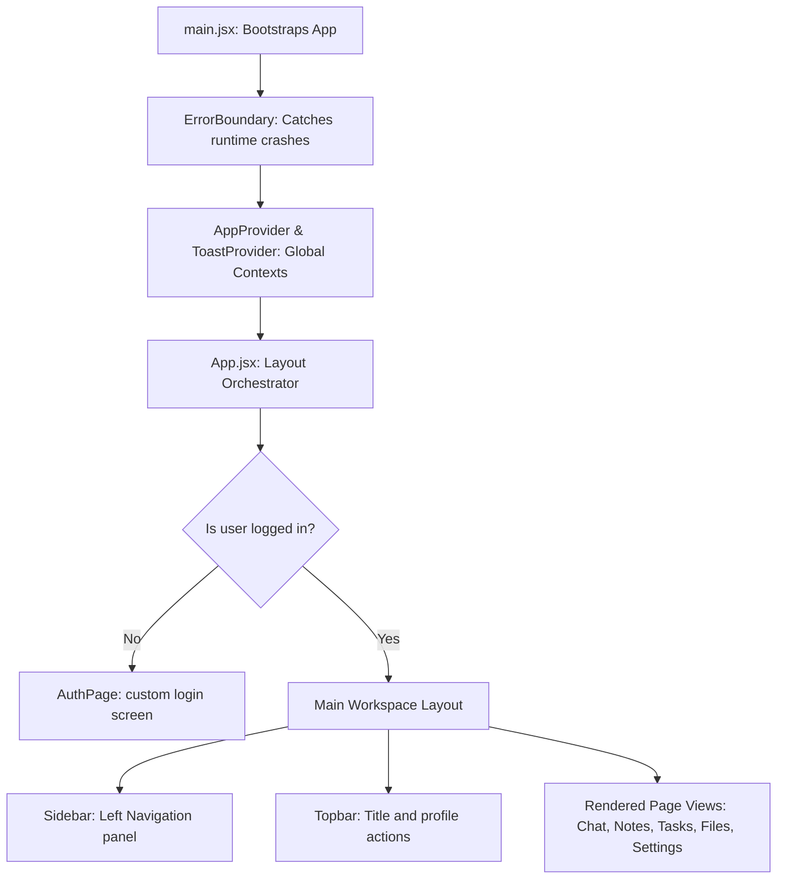
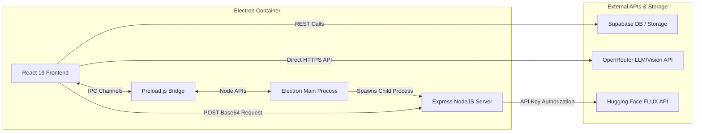
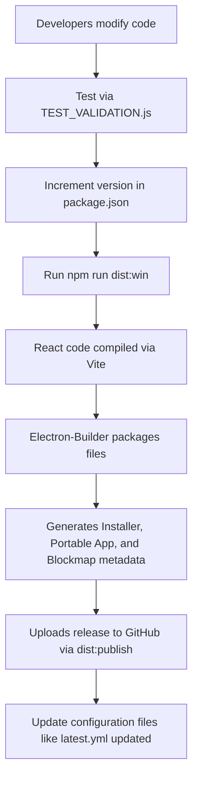

# 🌌 Ronit Workspace — AI-Powered Desktop Workspace

[](https://react.dev/)
[](https://www.electronjs.org/)
[](https://supabase.com/)
[](https://expressjs.com/)
[](https://vite.dev/)

An advanced, production-grade, AI-powered personal productivity workspace. Ronit Workspace integrates conversational AI, smart note-taking, rich task management, and file processing into a single local-first desktop application with secure cloud sync capabilities. Designed with modern aesthetics (glassmorphism, interactive animations) and desktop-first optimizations.

---

## 📖 Table of Contents

- [🌌 Ronit Workspace — AI-Powered Desktop Workspace](#-ronit-workspace--ai-powered-desktop-workspace)
  - [📖 Table of Contents](#-table-of-contents)
  - [🔍 Project Overview](#-project-overview)
    - [Core Tech Stack](#core-tech-stack)
  - [📂 Folder Structure](#-folder-structure)
  - [📄 File Explanations](#-file-explanations)
    - [Core Configuration \& Entry Files](#core-configuration--entry-files)
    - [Desktop Integration (`/electron`)](#desktop-integration-electron)
    - [Application Logic (`/src`)](#application-logic-src)
  - [🎨 Frontend Architecture](#-frontend-architecture)
    - [React Lifecycle \& Flow](#react-lifecycle--flow)
    - [Routing](#routing)
    - [State Management](#state-management)
    - [Component Communication](#component-communication)
  - [⚙️ Backend/System Architecture](#️-backendsystem-architecture)
    - [Express Backend Server (`server.cjs`)](#express-backend-server-servercjs)
    - [Authentication \& Session Flow](#authentication--session-flow)
    - [Database Schema \& Integration](#database-schema--integration)
    - [Dual-Tier Storage Strategy](#dual-tier-storage-strategy)
  - [🖥️ Electron Desktop App](#️-electron-desktop-app)
    - [Main Process \& Lifecycle](#main-process--lifecycle)
    - [Preload Bridge](#preload-bridge)
    - [Packaging \& Installer Configuration](#packaging--installer-configuration)
  - [✨ Features](#-features)
  - [⚡ Performance Engineering](#️-performance-engineering)
  - [📦 Build \& Release System](#-build--release-system)
    - [NPM Build \& Distribution Scripts](#npm-build--distribution-scripts)
    - [GitHub Releases \& Auto-Update Workflow](#github-releases--auto-update-workflow)
  - [🛠️ Installation \& Development Guide](#️-installation--development-guide)
    - [Prerequisites](#prerequisites)
    - [Step-by-Step Setup](#step-by-step-setup)

---

## 🔍 Project Overview

Ronit Workspace is designed to resolve context switching by consolidating everyday productivity tools (chat, notes, tasks, files) with cutting-edge LLM features.

The application functions in a **hybrid mode**:
* It runs as an **Electron Desktop App** which manages a local **Express backend helper** dynamically.
* Persists data securely to **Supabase (PostgreSQL)** for cross-device synchronization.
* Integrates an **offline-first local fallback storage** using **IndexedDB** and **Electron-Store/localStorage** when networks are degraded.
* Uses the **OpenRouter API** to provide highly cost-effective and smart AI processing capabilities, complete with Hinglish processing, text extraction, vision analysis, and text-to-image generation.

### Core Tech Stack

* **Frontend**: React 19, Lucide React (Icons), Framer Motion (Animations), Vanilla CSS (Custom Design System).
* **Desktop Frame**: Electron 42, Electron Builder, Electron Store, Electron Updater.
* **Backend Helper**: Express 5, Axios, Cors, Dotenv.
* **Cloud & Database**: Supabase Client (v2), PostgreSQL DB Schema.
* **AI Engine**: OpenRouter API Interface (default model: `gpt-4o-mini`), Hugging Face Inference API (`FLUX.1-schnell` via local server).

---

## 📂 Folder Structure

Below is the project directory tree containing tracked source files (excluding ignored build artifacts like `node_modules`, `dist`, `release`, and `.env` as defined in `.gitignore`):

```yaml
Ronit-Workspace/
├── build/
│   └── icon.ico                        # Desktop app installer & shortcut icon
├── electron/
│   ├── main.cjs                        # Electron main process (lifecycle, app update, backend manager)
│   └── preload.js                      # Secure context-isolated IPC bridge to React frontend
├── public/
│   ├── favicon.svg                     # Browser/app window tab icon
│   └── icons.svg                       # Asset vector graphics
├── src/
│   ├── components/
│   │   ├── chat/
│   │   │   ├── ChatInputEnhancements.css
│   │   │   ├── ChatMessage.css
│   │   │   ├── ChatMessage.jsx         # Individual bubble renderer for text, images, and files
│   │   │   ├── ChatWindow.css
│   │   │   ├── ChatWindow.jsx          # Chat message scroll list container
│   │   │   ├── FilePreview.jsx         # Inline file snippet preview block
│   │   │   ├── FileUploadButton.css
│   │   │   ├── FileUploadButton.jsx    # Custom file selector trigger
│   │   │   ├── ImageMessage.css
│   │   │   ├── ImageMessage.jsx        # Image view block supporting copy, save, and fullscreen zoom
│   │   │   ├── InputBar.jsx            # Rich typing interface with file, voice, and system triggers
│   │   │   ├── MobileCameraButton.jsx  # Mobile/camera capture utility
│   │   │   ├── ModernSendButton.jsx    # Animated dynamic send state controller
│   │   │   └── VoiceButton.jsx         # Speech input control button (stub hook)
│   │   ├── common/
│   │   │   ├── Button.jsx              # Reusable customized interactive button
│   │   │   ├── ErrorBoundary.jsx       # Fallback visual block catching React runtime crashes
│   │   │   ├── Modal.jsx               # Universal animated popup overlay
│   │   │   ├── UpdateNotification.css
│   │   │   └── UpdateNotification.jsx  # Electron Updater UI notification banner
│   │   ├── files/
│   │   │   ├── FileCard.jsx            # Individual file card view with delete & download triggers
│   │   │   ├── FileList.jsx            # Grid/list display mapping uploaded records
│   │   │   └── FileUpload.jsx          # Drag-and-drop workspace uploader
│   │   ├── keyboard/
│   │   │   ├── SymbolButton.jsx        # Clickable characters for typing
│   │   │   └── SymbolKeyboard.jsx      # Slide-out keyboard overlay for quick symbol entry
│   │   ├── layout/
│   │   │   ├── ChatSkeletonLoader.jsx  # Loading visual placeholders for chat list
│   │   │   ├── Sidebar.jsx             # Left sidebar navigation with theme options & update check
│   │   │   ├── Skeleton.jsx            # Multi-purpose structural visual loaders
│   │   │   └── Topbar.jsx              # Window header showing profile indicator and menu options
│   │   ├── notes/
│   │   │   ├── NoteCard.jsx            # Compact card snippet showing note summary
│   │   │   ├── NoteEditor.jsx          # Rich note editor with markdown support & AI tools
│   │   │   ├── NotesList.jsx           # Vertical note cards scroll block
│   │   │   └── NotesSidebar.jsx        # Filter, search, and pin controls for notes
│   │   ├── tasks/
│   │   │   ├── TaskCard.jsx            # Task item showing checkbox, due dates, and priority chips
│   │   │   ├── TaskInput.jsx           # Task creation interface with quick priority/due-date selectors
│   │   │   └── TaskList.jsx            # Task manager grouping items by completed status
│   │   │   └── voice/                  # Reserved for future audio integration
│   │   │   └── image/                  # Reserved for future static image overrides
│   │   ├── context/
│   │   │   ├── AppContext.jsx          # Main global state wrapper (Auth, update info, active sessions)
│   │   │   └── ToastContext.jsx        # Dynamic transient message notification dispatch
│   │   ├── hooks/
│   │   │   └── useChat.js              # Reserved custom chat hook placeholder
│   │   ├── pages/
│   │   │   ├── AuthPage.jsx            # custom username/password login & registration view
│   │   │   ├── ChatPage.jsx            # Layout manager for AI chatbot interfaces
│   │   │   ├── FilesPage.css
│   │   │   ├── FilesPage.jsx           # Workspace files index panel
│   │   │   ├── NotesPage.jsx           # Note manager layout interface
│   │   │   ├── SettingsPage.jsx        # User settings: device sessions, cleanup, profile username
│   │   │   └── TasksPage.jsx           # Task coordinator panel
│   │   ├── services/
│   │   │   ├── authService.js          # Authentication state management (custom DB-based auth)
│   │   │   ├── chatImageService.js     # Image serialization, parsing, and storage helper
│   │   │   ├── chatService.js          # Database fetch and sync routines for chat history
│   │   │   ├── dbService.js            # Safe database execution helper with auto column/table fallback
│   │   │   ├── deviceUtility.js        # Machine ID & user agent platform detector
│   │   │   ├── exportService.js        # Note-to-HTML parser representing a PDF export layout
│   │   │   ├── fileAnalysisService.js  # Multi-format document parser sending data to OpenRouter
│   │   │   ├── filesService.js         # Supabase Storage & local fallback image upload client
│   │   │   ├── imageAnalysisService.js # OpenRouter Multimodal Vision client with helper functions
│   │   │   ├── imageEnhancementService.js # Enhancement workflow routing stub
│   │   │   ├── imageGenerationService.js # Triggers FLUX model processing over Express server API
│   │   │   ├── imageStorageService.js  # Local IndexedDB and OS file reader cache utility
│   │   │   ├── intentDetectionService.js # Keyword scoring router for identifying visual request intents
│   │   │   ├── localStorageService.js  # IndexedDB local cache for offline session support
│   │   │   ├── notesService.js         # Note records creator and remote database synchronization
│   │   │   ├── openai.js               # Central OpenRouter Chat Completion API implementation
│   │   │   ├── profilesService.js      # User metadata controller enforcing unique username checks
│   │   │   ├── routingService.js       # Gatekeeper deciding routing based on file inputs and intent
│   │   │   ├── sessionCleanupService.js # Hourly routine deleting expired active device sessions
│   │   │   ├── sessionManagementService.js # Multi-device monitor locking log-ins beyond 3 sessions
│   │   │   ├── supabase.js             # Initialized Supabase JS client
│   │   │   └── tasksService.js         # Task DB action handler
│   │   ├── styles/
│   │   │   └── App.css                 # Main global styling with color themes and layout styles
│   │   ├── utils/
│   │   │   ├── backendDiagnostics.js   # Automated endpoints checker running via browser console
│   │   │   ├── fileParser.js           # Multi-file type parser (TXT, PDF extract) returning text blobs
│   │   │   ├── helpers.js              # Helper function placeholder
│   │   │   ├── hinglishProcessor.js    # Preprocessor correcting typo corrections for Hinglish text
│   │   │   ├── languageDetector.js     # NLP engine routing user queries into correct prompt templates
│   │   │   ├── systemValidation.js     # Runtime test suite validating APIs and routing states
│   │   │   ├── tokenCounter.js         # Chat history context-trimmer optimizing token payloads
│   │   │   └── windowState.js          # Session preservation tracking navigation and scroll depth
│   │   ├── App.jsx                     # Top Level React app coordinator
│   │   ├── index.css                   # Global styling configuration (CSS variables and scrollbars)
│   │   └── main.jsx                    # React bootstrap entry point with ErrorBoundary
│   ├── eslint.config.js                # Code linter rules configuration
│   ├── electron-builder.yml            # Compilation parameters for packaging desktop executables
│   ├── index.html                      # HTML DOM layout skeleton loading fonts and React app
│   ├── package.json                    # Configuration definitions, commands list, and dependencies
│   ├── server.cjs                      # Node Express backend handling Hugging Face API image generation
│   ├── supabase_migrations.sql         # Base PostgreSQL setup schemas (notes, sessions, tasks)
│   ├── supabase_chat_images_migration.sql # Setup instructions for Supabase Storage buckets & policies
│   ├── TEST_VALIDATION.js              # Pre-release verification validation suite
│   ├── test-db.mjs                     # Fast testing check for Supabase DB connections
│   ├── test-image-detection.js         # Scoring rules tester for visual intent classifications
│   └── vite.config.js                  # Vite builder configuration with code splitting rules
```

---

## 📄 File Explanations

### Core Configuration & Entry Files

* **[`package.json`](file:///c:/Users/Ronit%20Chahar/Desktop/Ronit-Workspace/package.json)**
  * *Purpose*: Holds core runtime dependencies, development configuration, and electron-builder specifications.
  * *Connections*: Defines `electron/main.cjs` as the application's entry script and outlines build/run lifecycle scripts.
* **[`vite.config.js`](file:///c:/Users/Ronit%20Chahar/Desktop/Ronit-Workspace/vite.config.js)**
  * *Purpose*: Configures Vite build processes (specifying Output directory `dist/`, minification targets via Terser, and custom roll-up chunks).
  * *Optimizations*: Implements chunk splitting separating react-vendor, framer-motion, supabase, lucide, and chat components for better performance.
* **[`index.html`](file:///c:/Users/Ronit%20Chahar/Desktop/Ronit-Workspace/index.html)**
  * *Purpose*: Top-level entry document serving the root container `<div id="root">` and embedding the Inter Google Font and `src/main.jsx`.

### Desktop Integration (`/electron`)

* **[`electron/main.cjs`](file:///c:/Users/Ronit%20Chahar/Desktop/Ronit-Workspace/electron/main.cjs)**
  * *Purpose*: Runs on Electron's NodeJS main thread. Bootstraps app windows, configures system level shortcuts, monitors hardware acceleration arguments, manages updates using `electron-updater`, and launches the Express backend as a child process.
  * *Connections*: Starts the Node server `server.cjs` and injects `preload.js` during browser window generation.
* **[`electron/preload.js`](file:///c:/Users/Ronit%20Chahar/Desktop/Ronit-Workspace/electron/preload.js)**
  * *Purpose*: Bridges the main Electron process and the React renderer process using context isolation and security sandboxing.
  * *Connections*: Exposes a safe subset of global tools (`window.electron`) for IPC message delivery.

### Application Logic (`/src`)

#### Context Providers
* **[`src/context/AppContext.jsx`](file:///c:/Users/Ronit%20Chahar/Desktop/Ronit-Workspace/src/context/AppContext.jsx)**
  * *Purpose*: Distributes global app states including logged-in user information, device session identifiers, profile configurations, and current desktop updates state.
  * *Connections*: Serves as the central state hub. Communicates with local system listeners using `electron/preload.js` IPC callbacks.
* **[`src/context/ToastContext.jsx`](file:///c:/Users/Ronit%20Chahar/Desktop/Ronit-Workspace/src/context/ToastContext.jsx)**
  * *Purpose*: Distributes transient visual warning and error messages to users across the app UI.

#### Core Pages
* **[`src/pages/AuthPage.jsx`](file:///c:/Users/Ronit%20Chahar/Desktop/Ronit-Workspace/src/pages/AuthPage.jsx)**
  * *Purpose*: Collects login/signup credentials and submits them to `authService.js` to establish user sessions.
* **[`src/pages/ChatPage.jsx`](file:///c:/Users/Ronit%20Chahar/Desktop/Ronit-Workspace/src/pages/ChatPage.jsx)**
  * *Purpose*: Coordinates active AI conversation views, handling message inputs, routing, streaming states, and displaying AI-generated assets.
* **[`src/pages/NotesPage.jsx`](file:///c:/Users/Ronit%20Chahar/Desktop/Ronit-Workspace/src/pages/NotesPage.jsx)**
  * *Purpose*: The main entry UI for managing notes. Integrates search bars, sorting options, side lists, and the Note Editor component.
* **[`src/pages/TasksPage.jsx`](file:///c:/Users/Ronit%20Chahar/Desktop/Ronit-Workspace/src/pages/TasksPage.jsx)**
  * *Purpose*: Coordinates the task creation input area and splits tasks into active or completed lists.
* **[`src/pages/FilesPage.jsx`](file:///c:/Users/Ronit%20Chahar/Desktop/Ronit-Workspace/src/pages/FilesPage.jsx)**
  * *Purpose*: The UI panel for managing workspace files. Handles file grid layouts, search functionality, size displays, and deletion/downloads.
* **[`src/pages/SettingsPage.jsx`](file:///c:/Users/Ronit%20Chahar/Desktop/Ronit-Workspace/src/pages/SettingsPage.jsx)**
  * *Purpose*: Central panel for updates, changing usernames/avatars, managing device session limits, and monitoring database cleanup states.

#### Services Layer
* **[`src/services/routingService.js`](file:///c:/Users/Ronit%20Chahar/Desktop/Ronit-Workspace/src/services/routingService.js)**
  * *Purpose*: Decision gatekeeper that inspects user queries or attachments to route them to the correct service pipeline (Image Analysis, File Analysis, Image Generation, or Text Chat).
* **[`src/services/openai.js`](file:///c:/Users/Ronit%20Chahar/Desktop/Ronit-Workspace/src/services/openai.js)**
  * *Purpose*: Interfaces directly with the OpenRouter API. Handles user queries, chat history formatting, Hinglish processing overrides, system prompt creation, and multimodal payloads.
* **[`src/services/imageGenerationService.js`](file:///c:/Users/Ronit%20Chahar/Desktop/Ronit-Workspace/src/services/imageGenerationService.js)**
  * *Purpose*: Generates images from text descriptions. Automatically enhances prompts and makes POST requests to the Express helper server (`/api/generate-image`).
* **[`src/services/imageAnalysisService.js`](file:///c:/Users/Ronit%20Chahar/Desktop/Ronit-Workspace/src/services/imageAnalysisService.js)**
  * *Purpose*: Vision model interface. Handles image conversion, validation, and specialized prompts for OCR, problem-solving, document reading, and accessibility captions.
* **[`src/services/fileAnalysisService.js`](file:///c:/Users/Ronit%20Chahar/Desktop/Ronit-Workspace/src/services/fileAnalysisService.js)**
  * *Purpose*: Document parsing and analysis service. Extracts text from various document types (PDFs, spreadsheets, code files) and sends it to the AI for analysis.
* **[`src/services/sessionManagementService.js`](file:///c:/Users/Ronit%20Chahar/Desktop/Ronit-Workspace/src/services/sessionManagementService.js)**
  * *Purpose*: Restricts user sessions to 3 concurrent active devices. Stores session data in Supabase (`active_sessions` table) to track last-active dates and platforms.
* **[`src/services/stableStorageService.js`](file:///c:/Users/Ronit%20Chahar/Desktop/Ronit-Workspace/src/services/stableStorageService.js)**
  * *Purpose*: Multi-tier storage coordinator. Uses Electron-Store when running as a desktop app, falling back to localStorage in browsers. Saves chats and metadata, and automatically strips large binary data URLs to prevent storage bloat.
* **[`src/services/localStorageService.js`](file:///c:/Users/Ronit%20Chahar/Desktop/Ronit-Workspace/src/services/localStorageService.js)**
  * *Purpose*: Configures IndexedDB tables (`chatHistory`, `chatSessions`) to cache messages and files locally for offline use.
* **[`src/services/dbService.js`](file:///c:/Users/Ronit%20Chahar/Desktop/Ronit-Workspace/src/services/dbService.js)**
  * *Purpose*: A database utility wrapper. Dynamically handles PostgreSQL errors (like missing columns/tables on legacy environments) to keep the app running.
* **[`src/services/notesService.js`](file:///c:/Users/Ronit%20Chahar/Desktop/Ronit-Workspace/src/services/notesService.js)**, **[`src/services/tasksService.js`](file:///c:/Users/Ronit%20Chahar/Desktop/Ronit-Workspace/src/services/tasksService.js)**, **[`src/services/filesService.js`](file:///c:/Users/Ronit%20Chahar/Desktop/Ronit-Workspace/src/services/filesService.js)**, **[`src/services/profilesService.js`](file:///c:/Users/Ronit%20Chahar/Desktop/Ronit-Workspace/src/services/profilesService.js)**
  * *Purpose*: Domain-specific data services. Handle database communication (fetching, adding, updating, deleting) with automatic fallback structures.

---

## 🎨 Frontend Architecture

The frontend is a single-page application built on React 19. It uses a custom CSS styling framework optimized for Electron desktop rendering.



### React Lifecycle & Flow

1. **Bootstrapping**: `src/main.jsx` starts the app. It wraps everything in `ErrorBoundary`, `AppProvider`, and `ToastProvider`, then mounts `App.jsx` to the root DOM node.
2. **Context Setup**: `AppProvider` runs first to restore user authentication data and check for desktop update notifications via IPC channels.
3. **View Rendering**: `App.jsx` checks the state of `user`. If no active session exists, it renders `AuthPage`. If a session is valid, it shows the workspace containing `Sidebar`, `Topbar`, and the active page component.
4. **State Caching**: Page switching is optimized by using `useMemo` to keep page content cached in memory, preventing unnecessary re-renders.

### Routing

* The application uses **state-driven routing** rather than a library like React Router, which is ideal for Electron applications to avoid file-protocol navigation issues.
* Pages are tracked using the `activePage` state inside `App.jsx` and navigated using a callback:
  ```javascript
  const handleSetActivePage = useCallback((page) => {
    setActivePage(page);
  }, []);
  ```
* Global navigation changes can also be triggered outside components (like from desktop notifications) using custom window events:
  ```javascript
  window.dispatchEvent(new Event("NAVIGATE_TO_CHAT"));
  ```

### State Management

Instead of using complex external libraries, the app manages state using built-in React hooks for better performance and simplicity:
* **`AppContext.jsx`**: Manages global data (authentication states, active user profile details, active desktop app update download metrics).
* **`ToastContext.jsx`**: Handles temporary alerts (success popups, warnings, errors) and auto-deletes them after 3 seconds.
* **Component-Level States**: Managed locally using standard `useState` hooks. Heavy calculations, lists, and theme setups are optimized using `useMemo` and `useCallback` to prevent unnecessary performance overhead.

### Component Communication

* **Parent-to-Child**: Standard unidirectional props.
* **Context**: Used to pass global data down the component tree without prop drilling (such as the current user, themes, active sessions, and toast alerts).
* **Custom Event Dispatchers**: Used for decouple communication across separate component branches. For example, updating an avatar fires a window event:
  ```javascript
  window.dispatchEvent(new CustomEvent("avatar_updated", { detail: newUrl }));
  ```

---

## ⚙️ Backend/System Architecture

The backend system is designed to provide secure cloud database access and local desktop integration, handling heavy AI features like image generation locally.



### Express Backend Server (`server.cjs`)

The Electron application runs a local Node.js Express server (`server.cjs`) as a child process. This server acts as a helper to:
1. **Manage Environment Variables**: Reads and loads keys from `.env` files safely.
2. **Handle Image Generation**: Receives prompt generation requests, routes them to Hugging Face models using server-side API keys, converts the returned binary data into clean base64 data URLs, and sends them back to the React app.
3. **System Diagnostics**: Hosts health and status endpoints (`/health`, `/api/diagnostics`) to help with testing and monitoring.

### Authentication & Session Flow

Unlike standard OAuth setups, Ronit Workspace uses a custom database-backed login system for better control:
* Accounts are stored in a custom `users` database table, referencing password hashes to keep credentials secure.
* During login, `authService` checks active device limits. If the user is logged into more than 3 devices, login is blocked until they log out of a previous session.
* Once logged in, a session heartbeat is updated in the database (`active_sessions`) to monitor active connections and clean up old sessions.

### Database Schema & Integration

The backend is powered by a custom Supabase PostgreSQL schema:
* **`users`**: Main account credentials, avatars, and registration timestamps.
* **`profiles`**: Public profile details linked to accounts via cascade delete rules.
* **`notes`**: Stores titles, content, pinning preferences, and modification history.
* **`tasks`**: Stores task items, tracking task completion status, deadlines, and priorities.
* **`files`**: Database index storing metadata for uploaded files, pointing to their cloud URLs.
* **`chat_sessions` / `chat_history`**: Stores AI conversation trees and linked image attachments.

### Dual-Tier Storage Strategy

To ensure a fast, offline-first experience, the application uses a dual-tier storage strategy:
1. **Online Database Layer**: Supabase serves as the primary database for syncing data across devices.
2. **Offline-First Local Cache**:
   * **IndexedDB**: Handled by `localStorageService.js` to store chat histories and cache image files locally for offline access.
   * **Electron Store (Desktop-only)**: A fast, local file-based key-value store used to save user configurations and app states, falling back to browser `localStorage` when running in the browser.

---

## 🖥️ Electron Desktop App

The desktop application is built with Electron, packaging the web app into a native desktop executable with system-level integrations.

### Main Process & Lifecycle

Managed by `electron/main.cjs`, the main process controls:
* **GPU Hardware Acceleration**: Configures settings like `enable-gpu-rasterization` to ensure smooth rendering and visual performance.
* **Memory & Resources**: Disables unnecessary extensions and services to minimize the app's memory footprint.
* **Window Lifecycle**: Creates the main application window with native, frameless title bars, maximizing the view area.
* **Process Management**: Spawns and manages the local Express server, and ensures it's terminated when the app closes.
* **Keyboard Shortcuts**: Prevents accidental web page reloads (by disabling keys like F5 and Ctrl+R) to keep the app feeling like a native desktop program.

### Preload Bridge

The `electron/preload.js` script securely bridges the main process and the web app:
* **Context Isolation**: Enabled by default, keeping the web page separate from Node.js APIs to prevent security vulnerabilities.
* **IPC Channel Communication**: Exposes a safe, limited communication API (`window.electron`) for sending events between React and the main process, such as handling update progress or system restarts.

### Packaging & Installer Configuration

Build configurations are defined in `electron-builder.yml` and `package.json`, which handle:
* **NSIS Installers**: Generates an installer (`Ronit Workspace Setup 1.0.0.exe`) that configures desktop shortcuts, start menu entries, and installation folder paths.
* **Portable Builds**: Builds standalone executables (`Ronit Workspace-1.0.0-portable.exe`) that run immediately without installation, storing user data in local AppData folders.
* **GitHub Auto-Updates**: Connects with GitHub Releases to publish build configurations and check for new releases automatically.

---

## ✨ Features

| Feature Name | Description | Technical Implementation |
| :--- | :--- | :--- |
| **🤖 AI Chat** | Conversational chat with Hinglish detection, grammar correction, and token management. | `openai.js` via OpenRouter completions API |
| **📝 Notes** | Markdown note editor with customizable font sizes, color tags, search filters, and PDF/HTML exports. | `NoteEditor.jsx` & `exportService.js` |
| **✔️ Tasks** | Task lists sorted by deadlines and priorities (High, Medium, Low). | `tasksService.js` & `TaskInput.jsx` |
| **📁 Files** | File manager with drag-and-drop uploads, type validation, and file deletion. | `filesService.js` & Supabase Storage |
| **👁️ Vision AI** | Image-to-text analysis, OCR, handwriting reading, and diagram explanations. | `imageAnalysisService.js` via OpenRouter Vision |
| **🎨 AI Art** | Text-to-image generator using the FLUX.1 model with auto-improved prompts. | `imageGenerationService.js` & HF API |
| **📊 Doc Analysis** | Upload and extract content from documents (PDFs, spreadsheets, code files) for AI analysis. | `fileAnalysisService.js` & PDF.js parser |
| **🔒 3-Device Guard** | Limits account logins to 3 active devices to manage database load. | `sessionManagementService.js` |
| **🔄 Auto Updates** | Automatic background updates with progress bars and easy restart-to-install options. | `UpdateNotification.jsx` & Electron-Updater |
| **🌓 Theme Switch** | Dark and light themes with animations, customizable scrollbars, and layouts. | `index.css` & CSS variables |

---

## ⚡ Performance Engineering

* **Code Splitting & Dynamic Bundling**: `vite.config.js` splits code chunks to isolate major dependencies (React, Framer Motion, Lucide, and Supabase) from the core app logic, reducing load times.
* **GPU Hardware Acceleration**: Electron launch settings enable GPU-based rendering and rasterization for smooth CSS transitions and animations.
* **Memory Management**: The `stableStorageService` automatically checks and strips heavy image data from JSON files, preventing app slowdowns.
* **Efficient Re-rendering**: Central pages and callback actions use React's `useMemo` and `useCallback` hooks to prevent unnecessary component updates.
* **Safe Database Queries**: A custom database query wrapper (`safeQuery`) handles database structural issues dynamically, preventing app crashes if database columns are missing.

---

## 📦 Build & Release System



### NPM Build & Distribution Scripts

Configure and package the project using these scripts defined in `package.json`:

* `npm run dev`: Starts the Vite development server locally (`http://127.0.0.1:5173`).
* `npm run server`: Launches the Express backend server (`http://localhost:3001`).
* `npm run electron-dev`: Launches the Electron desktop app in development mode once the Vite port is ready.
* `npm run full`: Runs the Vite frontend, Express backend, and Electron app concurrently in development mode.
* `npm run dist:win`: Builds the React frontend and packages it into Windows installers and portable executables.
* `npm run dist:portable`: Packages only the standalone portable Windows executable.
* `npm run dist:publish`: Compiles the app and uploads the release assets directly to the linked GitHub repository.

### GitHub Releases & Auto-Update Workflow

When updates are published, the release process generates critical update tracking files:

1. **`latest.yml`**: A configuration file containing release metadata, version numbers, and file hashes.
2. **`.blockmap` files**: Generates blockmaps (`Ronit Workspace Setup 1.0.0.exe.blockmap`) that analyze files in blocks, allowing the app to download only the changed parts of an update rather than redownloading the entire installer.
3. **Update Checks**: The app checks the repository's `latest.yml` on launch and hourly, downloading updates silently in the background and prompting the user to restart and install when ready.

---

## 🛠️ Installation & Development Guide

### Prerequisites

* [Node.js](https://nodejs.org/) (v18 or newer recommended)
* [Git](https://git-scm.com/)
* A [Supabase](https://supabase.com) project with database migrations applied.
* An [OpenRouter API Key](https://openrouter.ai/) and [Hugging Face Token](https://huggingface.co/).

### Step-by-Step Setup

1. **Clone the Repository**:
   ```bash
   git clone https://github.com/ronitworkspace/RonitWorkspace.git
   cd RonitWorkspace
   ```

2. **Configure Environment Variables**:
   Create a `.env` file in the root directory:
   ```env
   VITE_SUPABASE_URL=https://your-supabase-url.supabase.co
   VITE_SUPABASE_ANON_KEY=your-supabase-anon-key
   VITE_OPENROUTER_API_KEY=your-openrouter-key
   VITE_OPENROUTER_MODEL=gpt-4o-mini
   HF_TOKEN=your-huggingface-token
   PORT=3001
   ```

3. **Install Dependencies**:
   ```bash
   npm install
   ```

4. **Apply Database Migrations**:
   Run the SQL scripts in [`supabase_migrations.sql`](file:///c:/Users/Ronit%20Chahar/Desktop/Ronit-Workspace/supabase_migrations.sql) and [`supabase_chat_images_migration.sql`](file:///c:/Users/Ronit%20Chahar/Desktop/Ronit-Workspace/supabase_chat_images_migration.sql) using the Supabase SQL editor.

5. **Run in Development Mode**:
   Launch the frontend, backend, and Electron application concurrently:
   ```bash
   npm run full
   ```

6. **Build & Package Installers**:
   Generate production-ready installers and portable executables in the `release/` directory:
   ```bash
   npm run dist:win
   ```
